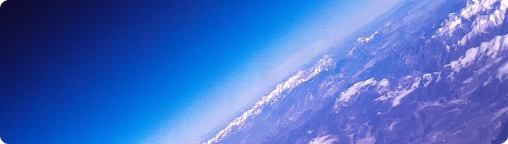

# Teste técnico Pessoa Desenvolvedora Front-end Júnior

Seja bem-vindo! Este desafio foi projetado para avaliar a capacidade técnica de candidatos às nossas vagas. Neste repositório você encontra o enunciado do desafio para a vaga de Pessoa Desenvolvedora Front-end Júnior da [Alura Space](https://www.alura.com.br/)!

## Desafio

A **Alura Space** é uma empresa de pesquisa espacial que faz imagens incríveis do universo observável, e vem buscando novas oportunidades de negócio. Porém, o time comercial não possui nenhuma ferramenta que facilite a visualização de suas fotos por clientes em potencial.

Para ajudar o time comercial, você deve **desenvolver uma interface que exiba as fotos coletadas pelos pesquisadores**. A interface já foi criada pelo time de design da empresa e [você pode acessá-la neste link](https://www.figma.com/file/Y1W8HJHKqlUdDFeWi8e4cz/Alura-Space-%7C-React%3A-arquivos-est%C3%A1ticos). Ela deve seguir a referência visual disponibilizada como logo, fontes e cores da marca registrada da empresa.

[Os arquivos de imagens estão disponíveis neste link](https://github.com/NeiltonSeguins/teste-tecnico-alura-space/archive/refs/heads/main.zip), e para facilitar a usabilidade, crie pelo menos um filtro de imagens para a aplicação. Contudo, funcionalidades extras serão consideradas um diferencial.

**Exemplo:** Filtrar imagens de planetas, estrelas ou galáxias quando for digitado esses termos na barra de pesquisa.

Para se sair bem neste desafio, elaboramos um conjunto de instruções que deve ser seguidas, pois influenciarão nos critérios de avaliação dos projetos enviados.

## Instruções

-   Utilize apenas [CSS/SCSS](https://sass-guidelin.es/) desenvolvido por você.

-   Utilize HTML semântico.

-   Se preocupe com a UX e UI do projeto elas serão levadas em consideração na avaliação.

-   Se atente nas [boas práticas do React.js](https://dev.to/abrahamlawson/react-style-guide-24pp).

-   Faça o Deploy do projeto em algum serviço de hospedagem de sua preferência ([Vercel](https://vercel.com/), [Heroku](https://www.heroku.com/), [Netlify](https://www.netlify.com/), etc).

-   Crie um Readme do seu projeto que contenha no mínimo um passo a passo de como rodar a aplicação.

## Avaliação

-   Instruções de como rodar o projeto
-   Componentização e extensibilidade dos componentes Javascript
-   Organização, semântica, estrutura, legibilidade, manutenibilidade do seu código
-   Alcance dos objetivos propostos

Desejamos uma boa sorte à todos!

---

<h4 align="center"> 
	
</h4>
<p align="center">
 <a href="#-sobre-o-projeto">Sobre</a> •
 <a href="#-funcionalidades">Funcionalidades</a> •
 <a href="#-layout">Layout</a> •
 <a href="#-tecnologias">Tecnologias</a> •
 <a href="#-autor">Autor</a> • 
 <a href="#user-content--licença">Licença</a>
</p>

<h1 align="center">
    
</h1>

## 💻 Sobre o projeto

🚀 Alura Space é uma aplicação desenvolvida para um teste técnico de uma vaga de pessoa desenvolvedora front-end jr. Se trata de uma galeria de imagens criada para a empresa [Alura Space](https://www.alura.com.br/) com o objetivo de exibir as imagens incríveis que ela produz do universo observável. É uma aplicação estática, que possui apenas uma página inicial mas que é altamente escalável para adição de novas funcionalidades!

---

## ⚙️ Funcionalidades

-   [x] Exibe uma galeria de imagens do universo;
-   [x] Possui animações de transform quando o mouse está sobre a imagem;
-   [x] Possibilidade de exibir as imagens por tags;

### Em breve

-   [ ] Possibilidade de realizar pesquisas pelo campo de busca da página;
-   [ ] Exibir mais imagens populares ao clicar no botão ver mais;
-   [ ] Adicionar funcionalidade de ver a imagem em tamanho grande (mnodal) quando clicar no ícone de expandir na imagem;
-   [ ] Adicionar o recurso de favoritar ou curtir as imagens;
-   [ ] Adicionar rotas e outras páginas na aplicação;
-   [ ] Implementar responsividade para telas menores;

---

## 🎨 Layout

O layout da aplicação está disponível no Figma:

<a href="https://www.figma.com/file/Y1W8HJHKqlUdDFeWi8e4cz/Alura-Space-%7C-React%3A-arquivos-est%C3%A1ticos?node-id=89%3A4">
  
</a>

#### 🧭 Rodando a aplicação web (Modo desenvolvimento)

```bash
# Clone este repositório
$ git clone https://github.com/NeiltonSeguins/alura-space.git
# Acesse a pasta do projeto no seu terminal/cmd
$ cd alura-space
# Instale as dependências
$ npm install
# Execute a aplicação em modo de desenvolvimento
$ npm run start
# A aplicação será aberta na porta:3000 - acesse http://localhost:3000
```

---

## 🛠 Tecnologias

As seguintes ferramentas foram usadas na construção do projeto:

#### **Website**

-   **[React](https://reactjs.org/)**
-   **[Sass](https://sass-lang.com/)**

#### **Utilitários**

-   Protótipo: **[Figma](https://www.figma.com/)** → **[Protótipo (Alura Space)](https://www.figma.com/file/Y1W8HJHKqlUdDFeWi8e4cz/Alura-Space-%7C-React%3A-arquivos-est%C3%A1ticos?node-id=89%3A4)**
-   Editor: **[Visual Studio Code](https://code.visualstudio.com/)**
    -   Extensão: **[S7 React/Redux/React-Native/JS snippets](https://marketplace.visualstudio.com/items?itemName=dsznajder.es7-react-js-snippets)**
-   CSS Modules: **[CSS Modules](https://github.com/css-modules/css-modules)**
-   Documentação do React: **[React Documentation](https://create-react-app.dev/docs/adding-a-stylesheet/)**

---

## 👩‍💻 Autora

<a href="https://www.instagram.com/andressacostaaaaaa/">
 
 <br />
 <sub><b>Andressa Da Costa</b></sub></a> <a href="https://www.linkedin.com/in/andressa-da-costa" title="Alura Space">🚀</a>
 <br />

[](https://www.linkedin.com/in/andressa-da-costa)
[](mailto:andressadacostan@gmail.com)

---

## 📝 Licença

Desenvolvido durante o curso de React [Alura](https://www.alura.com.br/).

Instrutor: [Neilton Seguins](https://www.linkedin.com/in/ne%C3%ADlton-seguins-bb8786a6/)

---
